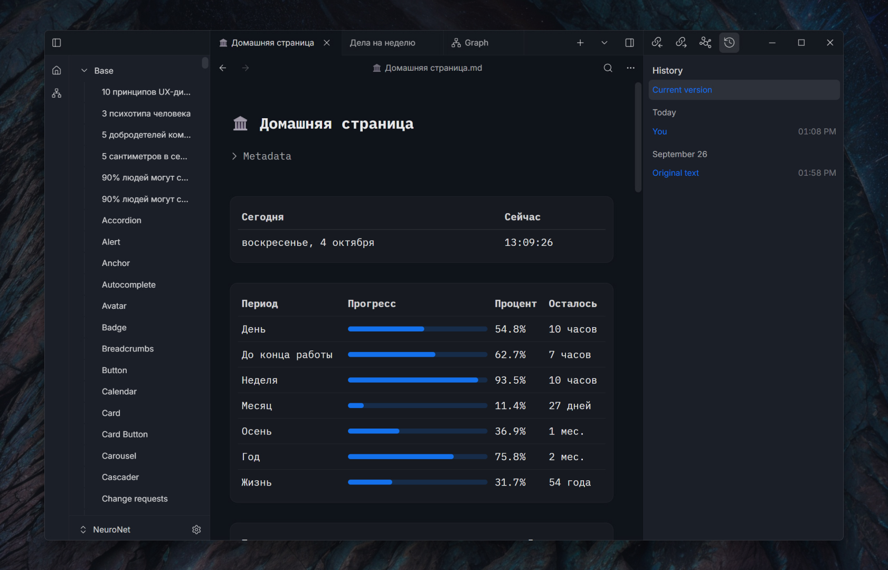
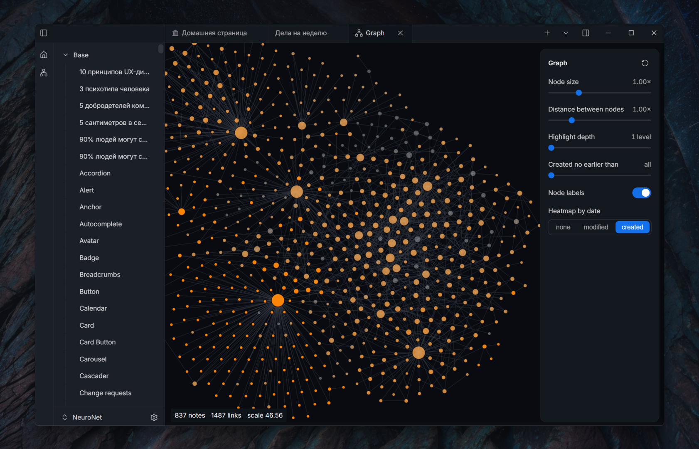
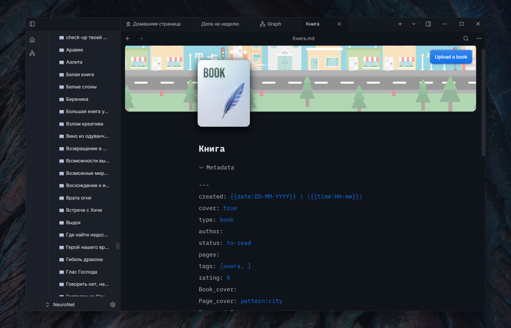
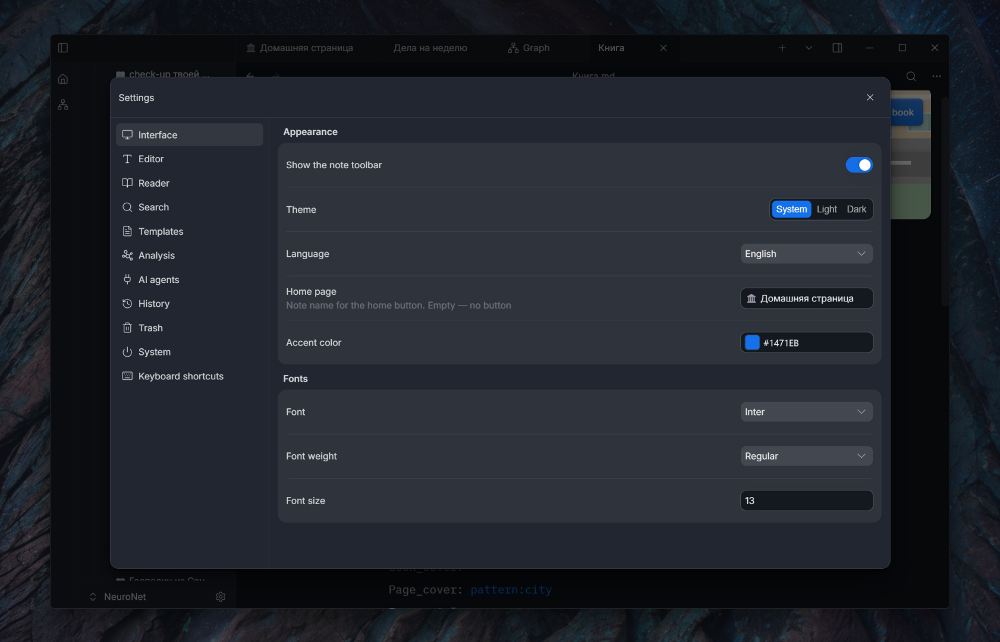
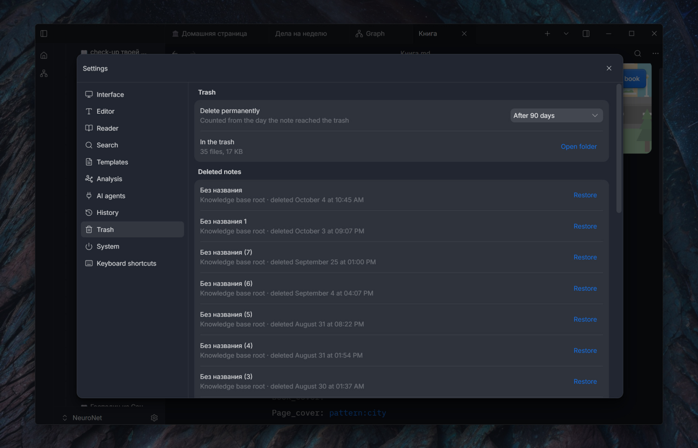

  

<h1 align="center">Aquilum</h1>

  A fast, local-first knowledge base for Windows. 
  Plain Markdown on your disk, with a focused editor, instant search, links, queries, and a built-in book reader.

  <a href="https://github.com/Freaction/Aquilum/releases/latest"><b>Download the latest version</b></a>
  · <a href="#installation">Installation</a>
  · <a href="README.ru.md">Русский</a>

---

## Your knowledge stays yours

Aquilum opens a folder you choose and works directly with the `.md` files inside it. There is no required account, proprietary note format, or cloud database. Notes and attachments remain usable in other tools, and you can back them up or synchronize them with any service you trust.

The desktop interface is built with Tauri and React; disk access, indexing, search, and queries run in Rust. The result is a responsive workspace that keeps its source of truth on your computer.

## A tour of Aquilum

### Start from a workspace that remembers where you were

Open a vault and continue from the same tabs and documents. A home note can combine ordinary Markdown with live `TABLE`, `LIST`, and `TASK` queries, while the history panel records changes, shows their source, compares versions, and lets you restore an earlier state.

### Find an idea from either direction

Full-text search returns matching notes as you type, with context around every result. When you want the wider picture, the graph turns wiki links into a navigable map with adjustable layout, node sizing, neighborhood highlighting, and date coloring.

<table>
  <tr>
    <td width="50%"></td>
    <td width="50%"></td>
  </tr>
</table>

### Write visually and keep portable Markdown

Live preview keeps formatting readable while preserving ordinary `.md` files on disk. The editor supports nested and numbered lists, callouts, tasks, code blocks, tables, links, frontmatter, page covers, and reusable templates. Markers reappear where you edit, so the underlying Markdown is never hidden from you.

Tasks remain ordinary Markdown checkboxes, but behave like controls in the editor. A `TASK` query can collect matching items from across the vault into a live rollup; completing an item there updates the source note as well.

Tables stay in Markdown too, while the visual editor adds practical controls for resizing columns, merging cells, and moving rows or columns.

### Keep media and context next to the text

Paste or import images and video into local attachments, crop images without leaving the editor, and place PDF files alongside the notes that explain them. Incoming and outgoing links remain visible below the document, helping you follow references without losing your current page.

### Turn books into part of the knowledge base

Keep EPUB, MOBI, AZW3, and FB2 files next to your notes. The library tracks reading progress, and the built-in reader provides a focused two-column layout with typography, justification, and hyphenation controls. Save selected passages as quotes in the book note, then connect them to the rest of your vault.

<table>
  <tr>
    <td width="50%"></td>
    <td width="50%"></td>
  </tr>
</table>

Book templates keep the cover, author, status, dates, rating, tags, and source file in structured frontmatter. Templates can also create other recurring note types and insert date or time placeholders.

### Make the workspace yours—and recover mistakes

Choose a light or dark theme, interface language, accent color, scale, fonts, line height, and content width for writing and reading. Deleted notes and folders go to a configurable trash instead of disappearing immediately, and can be restored to their previous location.

<table>
  <tr>
    <td width="50%"></td>
    <td width="50%"></td>
  </tr>
</table>

## Feature overview

### Writing and organization

- CodeMirror-based editor with live Markdown preview and document outline.
- Reorderable tabs, restored workspace sessions, and back and forward navigation.
- A file tree for creating folders, renaming, moving, duplicating, and safely deleting notes.
- YAML frontmatter presented as editable fields, plus quick insertion of a metadata starter block.
- Searchable templates that can be applied to the open note or used for a new one, with date and time placeholders and starter note and book templates.
- Images and videos pasted or imported into local attachments, with image cropping inside the editor.
- Multiple independent vaults, each with its own index.
- Note history with edit sources, visual diffs, named versions, full-version restore, and reversal of an individual change.
- Trash with configurable retention and restoration of notes and folders to their previous location.
- External changes are detected and merged safely; when an unambiguous merge is impossible, Aquilum preserves the disputed content in a conflict copy.

### Search and discovery

- Full-text vault search powered by Tantivy, with results while you type.
- Search inside the current note with highlighted matches.
- Typed metadata in the index for fast structured filtering.
- Backlinks, outgoing links, graph navigation, and related-note suggestions.
- Source analysis with Wikipedia discovery, candidate selection, and saving results into a note.
- Keyboard shortcuts for creating notes, global search, result navigation, and opening content in a new pane.

### Local-first collaboration with agents

Aquilum exposes an optional local MCP server. Compatible AI tools can search and read content, create or precisely edit notes, and work with links, metadata, version history, and trash. An agent can access another connected vault in the background without switching the user's active window or tabs. Documents use a Yjs CRDT model: changes are applied as small edits instead of replacing the entire note, allowing your typing and an agent's work to merge safely. The Markdown file on disk remains the durable source of truth.

### Export and portability

- Export a note to an A4 PDF using its rendered appearance.
- Keep ordinary Markdown and attachments in ordinary folders.
- Use your existing backup, version-control, or synchronization workflow.

## Installation

1. Open the [latest release](https://github.com/Freaction/Aquilum/releases/latest).
2. Download `aquilum-app_<version>_x64-setup.exe`.
3. Run the installer and choose a new or existing folder for your vault.

Aquilum installs for the current user and does not require administrator rights. The installer is not currently signed with a Windows code-signing certificate, so SmartScreen may show a warning. Choose **More info → Run anyway** if you downloaded it from this repository.

## Updates

Aquilum checks this public repository for updates at launch. When a newer version is available, it can download it, show progress, verify the signed update package, install it, and restart. Without a network connection, the app starts normally and your local vault remains available.

## Requirements

- Windows 10 or Windows 11, 64-bit.
- Microsoft Edge WebView2. It is normally present on Windows; the installer can obtain it when needed.

macOS and Linux builds are not published yet.

## Privacy and data locations

Your content remains on your computer:

- notes are `.md` files in the vault folder you selected;
- attachments and books live in that vault;
- settings, window state, search indexes, and other rebuildable application data live in Aquilum's application-data directory.

Aquilum does not require a cloud account. Network access is used for update checks and, only when you explicitly use source analysis, for retrieving Wikipedia material. The optional MCP server is local and starts only when enabled.

## Feedback

Report bugs and suggest improvements in [Issues](https://github.com/Freaction/Aquilum/issues). Please include the Aquilum version from **Settings → System → About**, what you expected, what happened, and the steps that reproduce it. Screenshots and a small example vault are useful when they do not contain private information.

## About this repository

This public repository contains Windows installers, update manifests, screenshots, and user-facing release information. Application development takes place in a separate private repository.
