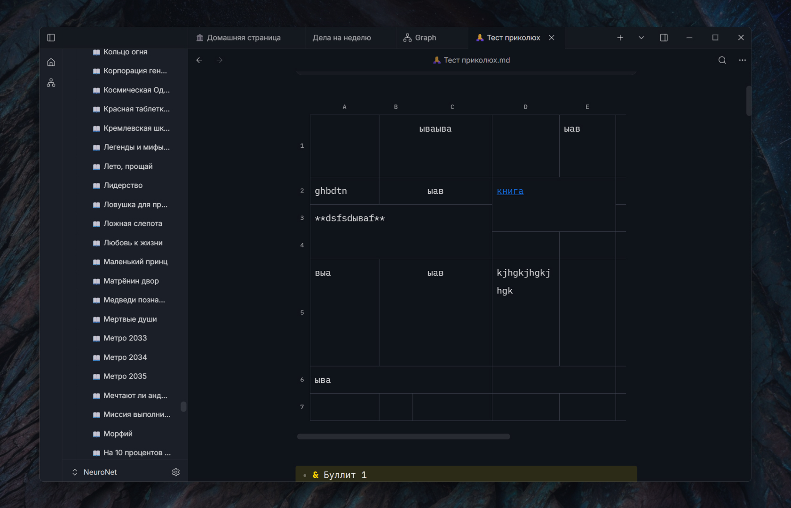

  

<h1 align="center">Aquilum</h1>

  A fast, local-first knowledge base for Windows. 
  Plain Markdown on your disk, with a focused editor, instant search, links, queries, and a built-in book reader.

  <a href="https://github.com/Freaction/Aquilum/releases/latest"><b>Download the latest version</b></a>
  · <a href="#installation">Installation</a>
  · <a href="README.ru.md">Русский</a>

---

## Your knowledge stays yours

Aquilum opens a folder you choose and works directly with the `.md` files inside it. There is no required account, proprietary note format, or cloud database. Notes and attachments remain usable in other tools, and you can back them up or synchronize them with any service you trust.

The desktop interface is built with Tauri and React; disk access, indexing, search, and queries run in Rust. The result is a responsive workspace that keeps its source of truth on your computer.

## A workspace, not just a text box

### Home pages and live queries

Create dashboards directly in a note. A `dataview` block can collect recent files, projects, books, or unfinished tasks without plugins or JavaScript. `TABLE`, `LIST`, and `TASK` queries support sources, filters, sorting, limits, file fields, metadata, and functions. Familiar DQL-style syntax makes many existing queries easy to move.

### Visual link graph

Explore every note and connection on one canvas. Adjust node size and spacing, highlight nearby links, use date coloring, and move from an overview straight to the note you need.

### Tasks across the vault

Markdown checkboxes are interactive in the editor. A `TASK` query gathers matching items from many notes into one live view, and completing an item updates its source note.

### Books and reading notes

Keep EPUB, MOBI, AZW3, and FB2 books next to your notes. The built-in reader remembers progress and offers a focused two-column layout, typography controls, justification, and hyphenation. Selected passages can be saved as quotes in the book note.

### Links, backlinks, and related notes

Use wiki links such as `[[Note]]`, inspect incoming and outgoing links, and discover relevant material without manually organizing everything. Text relevance and graph relationships help surface useful neighboring notes.

### Rich Markdown without leaving Markdown

Live preview hides markup until you edit it. Tables support resizing, merged cells, and row or column reordering while remaining Markdown. The editor also handles nested and numbered lists, callouts, code blocks, links, images, video, PDF attachments, frontmatter fields, page covers, and reusable note templates.

### A workspace tuned to you

Use light or dark themes, scale the interface, and configure fonts, line height, and content width separately for writing and reading. Aquilum includes Russian and English interfaces and restores the working context of your tabs and documents.

## Feature overview

### Writing and organization

- CodeMirror-based editor with live Markdown preview and document outline.
- Tabs plus back and forward navigation.
- YAML frontmatter presented as editable fields.
- Templates for consistently structured notes.
- Multiple independent vaults, each with its own index.
- Note history and trash support for recovering previous work.
- External file changes are detected, so edits from another tool do not leave the open note stale.

### Search and discovery

- Full-text vault search powered by Tantivy, with results while you type.
- Search inside the current note with highlighted matches.
- Typed metadata in the index for fast structured filtering.
- Backlinks, outgoing links, graph navigation, and related-note suggestions.

### Local-first collaboration with agents

Aquilum exposes an optional local MCP server. Compatible AI tools can search and read the vault, create or edit notes, and work with links and metadata. Documents use a Yjs CRDT model: changes are applied as small edits instead of replacing the entire note, allowing your typing and an agent's work to merge safely. The Markdown file on disk remains the durable source of truth.

### Export and portability

- Export a note to an A4 PDF using its rendered appearance.
- Keep ordinary Markdown and attachments in ordinary folders.
- Use your existing backup, version-control, or synchronization workflow.

## Installation

1. Open the [latest release](https://github.com/Freaction/Aquilum/releases/latest).
2. Download `aquilum-app_<version>_x64-setup.exe`.
3. Run the installer and choose a new or existing folder for your vault.

Aquilum installs for the current user and does not require administrator rights. The installer is not currently signed with a Windows code-signing certificate, so SmartScreen may show a warning. Choose **More info → Run anyway** if you downloaded it from this repository.

## Updates

Aquilum checks this public repository for updates at launch. When a newer version is available, it can download it, show progress, verify the signed update package, install it, and restart. Without a network connection, the app starts normally and your local vault remains available.

## Requirements

- Windows 10 or Windows 11, 64-bit.
- Microsoft Edge WebView2. It is normally present on Windows; the installer can obtain it when needed.

macOS and Linux builds are not published yet.

## Privacy and data locations

Your content remains on your computer:

- notes are `.md` files in the vault folder you selected;
- attachments and books live in that vault;
- settings, window state, search indexes, and other rebuildable application data live in Aquilum's application-data directory.

Aquilum does not require a cloud account. Network access is used for update checks and, only when you explicitly use source analysis, for retrieving Wikipedia material. The optional MCP server is local and starts only when enabled.

## Feedback

Report bugs and suggest improvements in [Issues](https://github.com/Freaction/Aquilum/issues). Please include the Aquilum version from **Settings → System → About**, what you expected, what happened, and the steps that reproduce it. Screenshots and a small example vault are useful when they do not contain private information.

## About this repository

This public repository contains Windows installers, update manifests, screenshots, and user-facing release information. Application development takes place in a separate private repository.
