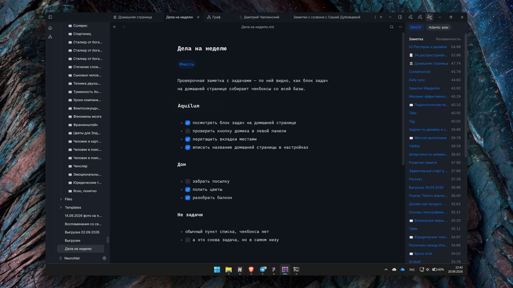

  

<h1 align="center">Aquilum</h1>

  Быстрая локальная база знаний для Windows. 
  Обычный Markdown на вашем диске, удобный редактор, мгновенный поиск, связи, запросы и встроенная читалка.

  <a href="https://github.com/Freaction/Aquilum/releases/latest"><b>Скачать последнюю версию</b></a>
  · <a href="#установка">Установка</a>
  · <a href="README.md">English</a>

---

## Ваши знания остаются вашими

Aquilum открывает выбранную вами папку и напрямую работает с `.md` файлами внутри неё. Обязательного аккаунта, закрытого формата заметок и облачной базы данных нет. Заметки и вложения остаются доступными в других программах, а для резервного копирования и синхронизации можно использовать любой сервис, которому вы доверяете.

Интерфейс приложения построен на Tauri и React, а работа с диском, индексом, поиском и запросами выполняется на Rust. В результате получается быстрый рабочий инструмент, единственный источник правды которого находится на вашем компьютере.

## Больше, чем текстовый редактор

### Домашние страницы и живые запросы

Собирайте дашборды прямо в заметке. Блок `dataview` может показать последние файлы, проекты, книги или незавершённые задачи — без плагинов и JavaScript. Запросы `TABLE`, `LIST` и `TASK` поддерживают источники, фильтры, сортировку, ограничения, поля файлов, метаданные и функции. Знакомый DQL-подобный синтаксис упрощает перенос существующих запросов.

### Наглядный граф связей

Исследуйте все заметки и связи на одном полотне. Настраивайте размер узлов и расстояния, подсвечивайте соседние связи, включайте окраску по дате и переходите от общего вида к нужной заметке.

### Интерактивные задачи и сводки

Markdown-чекбоксы интерактивны прямо в редакторе — именно это показано на скриншоте. Для общей сводки запрос `TASK` собирает подходящие пункты из разных заметок в единое живое представление, а завершение задачи в такой сводке обновляет исходную заметку.

### Книги и читательские заметки

Храните EPUB, MOBI, AZW3 и FB2 рядом с заметками. Встроенная читалка запоминает прогресс и предлагает спокойную двухколоночную вёрстку, настройку типографики, выключку по ширине и переносы. Выделенный фрагмент можно сохранить цитатой в заметку о книге.

### Ссылки, обратные ссылки и связанные заметки

Используйте вики-ссылки вида `[[Заметка]]`, просматривайте входящие и исходящие связи и находите полезные материалы без ручной раскладки по папкам. Текстовая релевантность и структура графа помогают поднимать соседние заметки по теме.

### Богатый Markdown, который остаётся Markdown

Живой предпросмотр показывает разметку только во время её редактирования. Таблицы поддерживают изменение размеров, объединение ячеек и перестановку строк или колонок, оставаясь обычным Markdown. Редактор также работает с вложенными и нумерованными списками, callout-блоками, кодом, ссылками, изображениями, видео, PDF-вложениями, полями frontmatter, обложками страниц и шаблонами заметок.

### Рабочее пространство под вас

Выбирайте светлую или тёмную тему, меняйте масштаб интерфейса, шрифты, межстрочный интервал и ширину текста отдельно для письма и чтения. В Aquilum есть русский и английский интерфейсы; контекст открытых вкладок и документов восстанавливается между запусками.

## Возможности

### Текст и организация

- Редактор на CodeMirror с живым предпросмотром Markdown и оглавлением документа.
- Вкладки с перетаскиванием, восстановление рабочей сессии и история переходов назад и вперёд.
- Дерево файлов с созданием папок, переименованием, перемещением, дублированием и безопасным удалением заметок.
- YAML frontmatter в виде редактируемых полей и быстрая вставка заготовки метаданных.
- Поиск по шаблонам, применение шаблона к открытой заметке или создание новой, подстановка даты и времени и стартовые шаблоны заметки и книги.
- Вставка изображений и видео из буфера или файла, локальное хранение вложений и кадрирование изображений прямо в редакторе.
- Несколько независимых хранилищ, каждое со своим индексом.
- История заметок с авторами изменений, просмотром различий, именованными версиями, восстановлением целой версии и отменой отдельного изменения.
- Корзина с настраиваемым сроком хранения и восстановлением заметок и папок на прежнее место.
- Отслеживание внешних изменений с безопасным слиянием и конфликтной копией, если однозначное слияние невозможно.

### Поиск и исследование

- Полнотекстовый поиск по базе на Tantivy с результатами во время набора.
- Поиск по текущей заметке с подсветкой совпадений.
- Типизированные метаданные в индексе для быстрых структурированных выборок.
- Обратные и исходящие ссылки, навигация по графу и рекомендации связанных заметок.
- Анализ источников с поиском материалов Wikipedia, выбором кандидатов и сохранением результата в заметку.
- Горячие клавиши для создания заметок, глобального поиска, навигации по результатам и открытия в новой панели.

### Локальная работа с ИИ-агентами

Aquilum предоставляет опциональный локальный MCP-сервер. Совместимые ИИ-инструменты могут искать и читать материалы, создавать и точечно редактировать заметки, работать со ссылками, метаданными, историей версий и корзиной. Агент может обращаться к другой подключённой базе в фоне, не переключая активное окно и вкладки пользователя. Документы используют CRDT-модель Yjs: изменения применяются небольшими правками вместо полной перезаписи, поэтому ваш ввод и работа агента безопасно сливаются. Надёжным источником правды остаётся Markdown-файл на диске.

### Экспорт и переносимость

- Экспорт заметки в A4 PDF с её отрисованным оформлением.
- Обычные Markdown-файлы и вложения в обычных папках.
- Совместимость с вашим способом резервного копирования, контроля версий или синхронизации.

## Установка

1. Откройте [последний релиз](https://github.com/Freaction/Aquilum/releases/latest).
2. Скачайте `aquilum-app_<версия>_x64-setup.exe`.
3. Запустите установщик и выберите новую или уже существующую папку для базы.

Aquilum устанавливается для текущего пользователя и не требует прав администратора. Сейчас установщик не подписан сертификатом подписи кода Windows, поэтому SmartScreen может показать предупреждение. Если файл скачан из этого репозитория, выберите **Подробнее → Выполнить в любом случае**.

## Обновления

При запуске Aquilum проверяет обновления в этом публичном репозитории. Если доступна новая версия, приложение может скачать её, показать прогресс, проверить подпись пакета, установить обновление и перезапуститься. Без подключения к сети Aquilum запускается как обычно, а локальная база остаётся доступной.

## Требования

- 64-разрядная Windows 10 или Windows 11.
- Microsoft Edge WebView2. Обычно он уже есть в Windows; при необходимости установщик может его загрузить.

Сборки для macOS и Linux пока не публикуются.

## Конфиденциальность и хранение данных

Ваши материалы остаются на вашем компьютере:

- заметки — `.md` файлы в выбранной папке базы;
- вложения и книги находятся в этой же базе;
- настройки, состояние окна, поисковые индексы и другие восстанавливаемые служебные данные находятся в каталоге данных Aquilum.

Aquilum не требует облачного аккаунта. Сеть используется для проверки обновлений и, только при явно запущенном анализе источников, для получения материалов Wikipedia. Опциональный MCP-сервер работает локально и запускается только после включения.

## Обратная связь

Сообщайте об ошибках и предлагайте улучшения во вкладке [Issues](https://github.com/Freaction/Aquilum/issues). Укажите версию из раздела **Настройки → Система → О программе**, ожидаемое и фактическое поведение, а также шаги для воспроизведения. Скриншоты и небольшая тестовая база помогут, если в них нет личных данных.

## Об этом репозитории

В этом публичном репозитории находятся установщики для Windows, манифесты обновлений, скриншоты и пользовательская информация о выпусках. Разработка приложения ведётся в отдельном закрытом репозитории.
